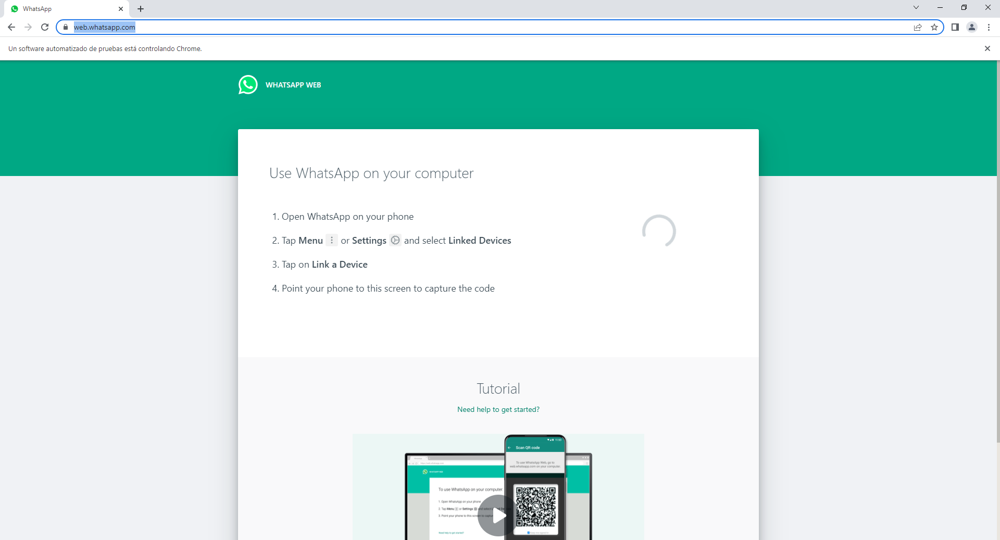

# Cheems.py


Cheems.py es un servidor en Python que envía multimedia asociada a Cheems todos los días de la semana por Whatsapp. Para su funcionamiento, es necesario tener instalado Chromedriver. Si no se tiene instalado, se debería descargar automáticamente. Además, se requiere importar la librería alright.

En caso de necesitar instalar Chromedriver:
- [Chromedriver para macOS](https://sites.google.com/a/chromium.org/chromedriver/downloads)
- [Chromedriver para Linux](https://sites.google.com/a/chromium.org/chromedriver/downloads)
- [Chromedriver para Windows](https://sites.google.com/a/chromium.org/chromedriver/downloads)
(En el repositorio hay un Chromedriver para Windows ARM)

## Como ejecutar el programa
``` python Cheems.py <Nº de teléfono> ```



Es muy probable que la primera vez se necesite escanear el QR, una vez hecho buscará la persona que coincida con el número de teléfono y enviará dos fotos, una dando los buenos días del día en concreto("Feliz Jueves"), y una imagen aleatoria de Cheems entre 31. Acto seguido entrará en suspensión hasta el día siguiente a la misma hora.
